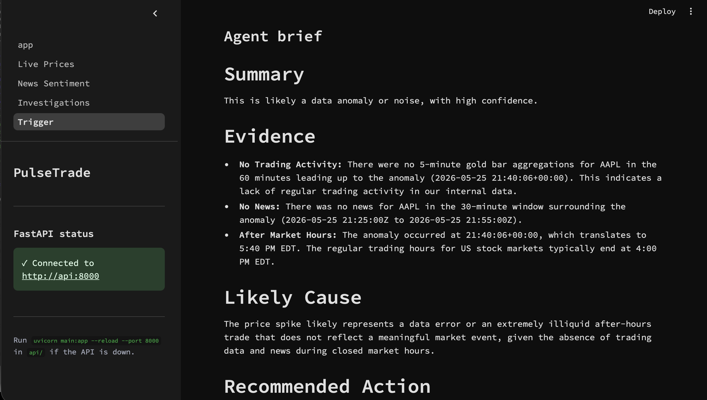
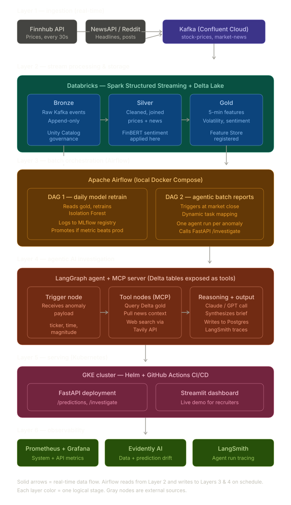

# PulseTrade

[](https://github.com/madhusiddharths/pulsetrade/actions/workflows/ci.yml)
[](LICENSE)

Real-time financial intelligence platform that streams market data through Kafka
and Delta Lake, then uses an agentic AI investigator to explain anomalies in
plain language.

**See it work:** the dashboard asks the agent "was this price spike real?" — the
agent pulls gold-layer windows and live news through its MCP tools, reasons with
Gemini, and renders a verdict with evidence:



> 🎬 A GIF of a live investigation running on GKE (public ingress URL) lands here
> after the day-13 session — see [docs/daily/day13.md](docs/daily/day13.md).

## Architecture

Seven-layer pipeline: ingestion → Kafka → Spark Structured Streaming → Delta
medallion → agentic AI → Kubernetes serving → observability. Real-time data flows
through layers 1–3 continuously; Airflow reads from layer 2 and writes to layers
3–4 on schedule.



- **Ingestion**: Python producers polling Finnhub + NewsAPI
- **Streaming**: Confluent Cloud Kafka, Spark Structured Streaming, Delta Lake on Databricks (Free Edition)
- **Sentiment**: FinBERT via Pandas UDF
- **Agent**: FastAPI + LangGraph + MCP + Gemini 2.5 Flash + Tavily
- **Storage**: Postgres (investigations) + Delta Lake (analytical)
- **Orchestration**: Apache Airflow
- **Serving**: Streamlit, GKE, Helm, GitHub Actions CI/CD
- **Observability**: Prometheus, Grafana, LangSmith, Evidently AI

## Status — built day by day, with receipts

Every day links to a journal entry; claims link to evidence. GKE serves the
demo stack (api + dashboard + postgres — [ADR-008](docs/adr/ADR-008-mcp-colocation.md),
[ADR-009](docs/adr/ADR-009-pod-vs-cluster.md)); Airflow and the observability
stack run locally by design ([ADR-006](docs/adr/ADR-006-observability-stack.md)).

| Day | Component | Runs | Proof |
|-----|-----------|------|-------|
| [1](docs/daily/day1.md) | Scaffolding, cloud accounts, healthcheck | ✅ local | journal |
| [2](docs/daily/day2.md) | Kafka producers (Finnhub + NewsAPI) | ✅ local → Confluent | [stock topic](docs/screenshots/kafka-stock-prices-topic.png) · [news topic](docs/screenshots/kafka-market-news-topic.png) |
| [3](docs/daily/day3.md) | Bronze → silver → gold medallion + FinBERT | ✅ Databricks | [bronze](docs/screenshots/bronze-tables-first-rows.png) · [silver+sentiment](docs/screenshots/silver-news-finbert-sentiment.png) · [gold](docs/screenshots/gold-5min-features.png) |
| [4](docs/daily/day4.md) | LangGraph agent + FastAPI + Postgres | ✅ local + GKE | journal |
| [5](docs/daily/day5.md) | MCP server + dynamic tool use (Tavily) | ✅ local + GKE | journal |
| [6](docs/daily/day6.md) | Airflow + anomaly detection | ✅ local (by design) | journal |
| [7](docs/daily/day7.md) | Streamlit dashboard | ✅ local + GKE | [agent brief](docs/screenshots/dashboard-agent-brief.png) |
| [8](docs/daily/day8.md)–[9](docs/daily/day9.md) | Prometheus, Grafana, Evidently drift | ✅ local (by design) | [load run](docs/screenshots/api-investigate-smoke-loop.png) |
| [10](docs/daily/day10.md)–[11](docs/daily/day11.md) | Containerize + compose stack | ✅ local | [first k8s trial](docs/screenshots/k8s-pods-services-first-deploy.png) |
| [12](docs/daily/day12.md) | Deploy to GKE with Helm (ephemeral) | ✅ GKE, torn down (~$0.15) | journal |
| [13](docs/daily/day13.md) | Ingress + CI/CD + evidence + teardown | 🚧 this session | [runbook](docs/runbook-gke.md) |
| 14–21 | Polish, demo, write-up | ✅ folded into day 13 | this README |

## Quickstart (one command, three containers)

The serving stack — Postgres, the agent API, and the dashboard — runs locally
with compose and real service-to-service networking (the same model the Helm
chart uses on GKE):

```bash
cp .env.example .env    # fill in the keys — the API validates at startup
docker compose up --build
```

Then:

- **Dashboard:** http://localhost:8501
- **API docs (interactive):** http://localhost:8000/docs
- **Trigger an investigation:**

```bash
curl -X POST http://localhost:8000/investigate \
  -H "Content-Type: application/json" \
  -d '{"ticker":"AAPL","anomaly_type":"price_spike","window_start":"2026-05-04T21:15:00Z","lookback_minutes":1500}'
```

The response is the investigation record the dashboard renders as an
[agent brief](docs/screenshots/dashboard-agent-brief.png): a verdict, evidence
bullets (trading activity, news, market hours), likely cause, and a
recommended action.

**Honest prerequisites** — this is a real pipeline, not a mock:

- The containers need `GOOGLE_API_KEY` and `DATABRICKS_*` to **boot** — config
  is validated fast at startup ([`api/config.py`](api/config.py)), so missing
  keys fail loudly with the field named, not with a `None` crash mid-request.
- A meaningful investigation needs the Databricks **gold** table populated
  (days 2–3 pipeline) and a `TAVILY_API_KEY` for live news search. Without
  them, expect an honest "no data in window" style brief, not magic.
- Everything runs on free tiers (Confluent, Databricks Free Edition, Gemini,
  Finnhub, NewsAPI, Tavily). A zero-key demo mode is parked in
  [TODOS.md](TODOS.md).

## Deploying to GKE (ephemeral, cost-disciplined)

The whole cloud session — create → deploy → verify → capture evidence →
destroy → **prove $0** — is one runbook:
[docs/runbook-gke.md](docs/runbook-gke.md). Deploys can also run through
[`deploy.yml`](.github/workflows/deploy.yml) (manual trigger; honest caveat:
the target cluster is ephemeral, so the deploy stage is demonstrated with
evidence, not left running).

## Development

- **Unit tests (offline, what CI runs):** `pip install -r requirements-ci.txt`
  then `pytest api/tests/unit drift/tests` — heavy integrations are stubbed;
  no credentials or network needed.
- **Lint:** `ruff check api producers drift dashboard`
- **Integration smoke tests (manual, need real keys):** script-style checks in
  [`api/tests/`](api/tests/) — e.g. `python api/tests/test_gemini.py`.
- **Per-service venvs** (`api/`, `producers/`, `drift/`, `dashboard/` each have
  `requirements.txt`) if you prefer running services on the host: start
  Postgres via `cd postgres && docker compose up -d`, then e.g.
  `cd api && uvicorn main:app --reload`.

## Docs tour

- [docs/daily/](docs/daily/) — the build journal, one entry per day, bugs included
- [docs/decisions.md](docs/decisions.md) — index of all 9 ADRs
- [docs/runbook-gke.md](docs/runbook-gke.md) — the ephemeral GKE session, teardown checklist included
- [docs/debugging.md](docs/debugging.md) — war stories and how they were run down
- [TODOS.md](TODOS.md) — deliberately deferred work, with pickup context

## Author

Madhu Siddharth Suthagar — MAS Data Science, Illinois Institute of Technology, 2026.

## License

[MIT](LICENSE)
