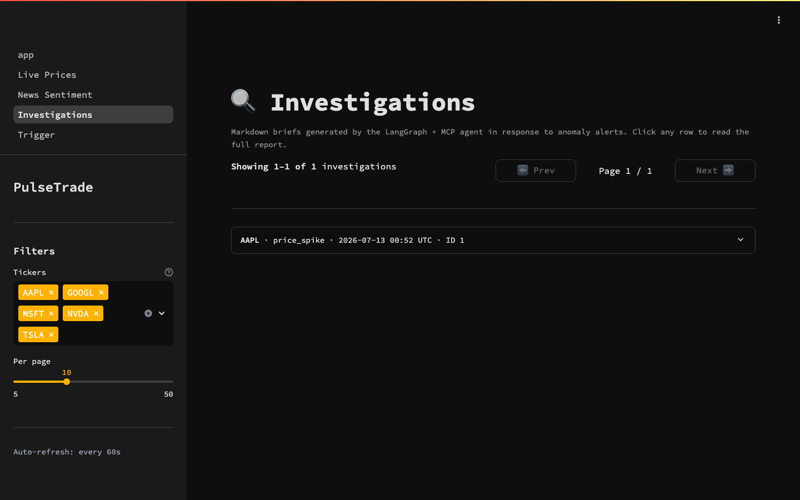
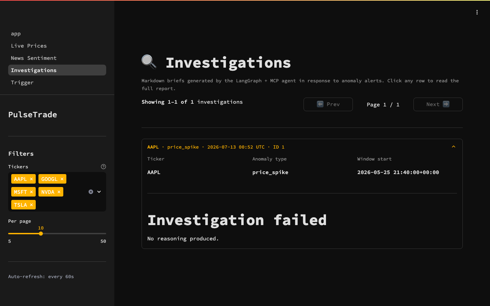

# Day 13 — Ingress verified, CI/CD live, the completion session

**Goal:** finish the build. Verify the split-ingress fix on a fresh ephemeral
GKE cluster, ship the deferred GitHub Actions CI/CD, capture the evidence, and
tear everything down to a verified $0.

## Outcome

All of it happened — plus a live bug hunt that made the session more valuable
than the plan. Split ingress **verified on a public IP**, CI/CD **green
end-to-end** (lint → offline tests → helm guard → amd64 build → Artifact
Registry push, and a green manual deploy run against the live cluster), an
investigation **completed on-cluster during a total Databricks outage** (the
agent fell back to live web search), three real bugs found and fixed, cluster
torn down, $0 state verified. Session cost ≈ $0.25.

## Block 3 verified: the websocket-rewrite bug → two Ingresses

`rewrite-target` is a per-Ingress annotation; in the single-Ingress version the
`/$2` rewrite that strips `/api` also mangled Streamlit's websocket path →
blank dashboard. Fix: **two Ingress resources sharing one ingressClass** (one
controller, one LB, one IP); rewrite lives only on the API Ingress.

Verified live at `http://34.9.115.224` (session IP):

```
/api/health   → 200 {"status": "ok"}          (rewrite strips /api ✓)
/api/ready    → 200 {"status": "ready", checks: postgres ok,
                     databricks "timed out (>3s)" — reported, NOT gating}
/api/docs     → 200                           (FastAPI docs through ingress)
/             → 200 Streamlit                 (dashboard at root)
/_stcore/health → "ok"                        (websocket path UNrewritten ✓)
```

Bonus proof: during the deploy demo the old single-Ingress version briefly ran
again, and `/_stcore/health` returned the SPA's index HTML instead of `ok` —
the bug, demonstrated live, minutes after its fix was demonstrated live.

## Block 4 shipped: CI/CD (four runs, each one a lesson)

- `ci.yml` (badged): ruff → offline pytest (11 tests, integrations stubbed) →
  helm lint + render guard → amd64 buildx; on main **with the `GCP_SA_KEY`
  secret present**, pushes `:sha`/`:latest` to Artifact Registry. The push
  steps self-skip when the secret is absent, so the badge survives teardown.
- `deploy.yml` (manual-only, badge-free): auth → cluster credentials →
  `helm upgrade --wait`. Run [#29216222033] went **green against the live
  cluster** — the deploy stage demonstrated, honestly, once.
- Run-by-run: #1 failed my own render guard (it asserted the split resource
  names while the split was deliberately uncommitted — guard now checks routing
  intent); #2 green; #3 hit a transient GAR `authorize: DeadlineExceeded` on
  the very first real push; #4 (re-dispatched) green with images landing in GAR.

## Block 5: the live session — three real bugs found under fire

### 1. The stale-image readiness trap
First deploy: api pod `0/1`, `/ready` probes timing out. The pod ran image
`v3` — built on day 12, **before** the postgres-only readiness gating existed
in code. With Databricks down (Free Edition unreachable all session), v3's
`/ready` hung on the warehouse. Even the fixed code had a margin bug: its 10s
Databricks time-box raced the kubelet's 10s probe timeout — now 3s
(`api/main.py`). Deployed via a CI-built image; `/ready` then answered
`"ready"` in milliseconds with Databricks honestly reported as down.

### 2. The e2-small rolling deadlock (+ an SSA gotcha)
Rolling updates need old+new api pods side by side; 2×e2-small can't fit two
256Mi requests → new pod Pending forever ("Insufficient memory"). Fix:
`strategy: Recreate` in the api Deployment. Second lesson: switching strategy
via server-side apply is rejected ("rollingUpdate: Forbidden…") because the
live object keeps the old rollingUpdate params — cleared with a JSON patch
replacing the whole `strategy` object.

### 3. The Gemini empty-name bug (found by the outage)
The on-cluster investigation ran 5 iterations: `get_recent_gold` FAILED
(warehouse down) → agent adapted → `get_news_for_window` FAILED → agent
adapted → **two parallel `tavily_web_search` calls succeeded** → then the next
Gemini call 400'd: `function_response.name: Name cannot be empty`. Root cause:
`agent/nodes.py` built `ToolMessage(content=…, tool_call_id=…)` **without
`name=`** — Gemini requires it, and the parallel-call turn exposed it. Fixed.
The saved report (`investigations` id 1) honestly reads "Investigation failed"
with the full error trail in `agent_thoughts` — kept as evidence.

### 4 (bonus). Day 12's "unused" env var was load-bearing
The dashboard's Investigations page showed "DB unavailable — synthetic" on the
cluster: `dashboard/lib/data.py` reads a single `POSTGRES_URL` DSN
(localhost default) — the var day 12's journal declared "unused by the code"
and filtered out of the Secret. It was used, by the dashboard; the page had
been silently degraded on-cluster since day 12. Fix: the ConfigMap now carries
`POSTGRES_URL` (+ `PULSETRADE_PG_*`) built from chart values — DB wiring lives
in ONE place, which was the day-12 lesson all along.

## The resilience demo (better than the happy path)

With the warehouse fully down, `POST /api/investigate` on the public URL still
produced a persisted investigation: tool failures handled, web-search fallback
exercised, report saved to postgres, **while `/health` and `/ready` served
200s throughout** (probes never flapped — the co-located MCP + readiness
design working under real fire). The dashboard rendered it from cluster
postgres via the public ingress:




Completed-brief rendering (with data available) was proven on day 12:
[agent brief](../screenshots/dashboard-agent-brief.png).

## Evidence

- `docs/screenshots/gke-dashboard-live.gif` — the dashboard live on the public
  ingress IP (home → investigations → detail → trigger)
- `gke-dashboard-home.png`, `gke-dashboard-investigations.png`,
  `gke-dashboard-investigation-detail.png`, `gke-dashboard-trigger.png`
- CI runs: green `ci.yml` (badge) and green `deploy.yml` #29216222033 on the
  repo's Actions tab

## Cost

Cluster ~1h50m × 2×e2-small (~$0.07/hr) + LB forwarding rule ≈ **$0.20-0.25**.
Control plane free (zonal free tier). GAR images kept (pennies/month).

## Teardown → verified $0

Per [the runbook](../runbook-gke.md): `helm uninstall` (app + ingress-nginx) →
PVC delete → `gcloud container clusters delete` → **GitHub `GCP_SA_KEY` secret
deleted + the CI service-account key destroyed** (no credential outlives the
session) → verify-$0 listings:

Captured 2026-07-13T04:41:09Z, all empty:

```
$ gcloud container clusters list        → (empty)
$ gcloud compute disks list             → Listed 0 items.
$ gcloud compute forwarding-rules list  → Listed 0 items.
$ gcloud compute addresses list         → Listed 0 items.
$ gcloud compute target-pools list      → Listed 0 items.
$ gh secret list                        → (empty)
$ gcloud iam service-accounts keys list --managed-by user → Listed 0 items.
```
